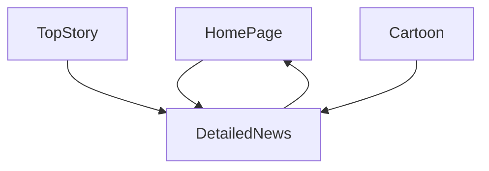

# Deccan_Chronical_Clone

This is the Clone of Deccan_Chronical news website. Deccan Chronicle publishes the largest circulated English newspaper in South India

## Installation

```
$ git clone https://github.com/ashelake/Deccan_Chronical_Clone.git
```
```
$ cd Deccan_Chronical_Clone
$ npm install
$ npm run start
```

## Run Json-server
```
$ cd server

```
## Teck Stack

- React
- NodeJS
- Bootstrap


## Flow



## 🔗 Collaborators Profile Links
| Collaborators  | Github  |  Linkedin   | Portfolio   |
| ---------- | -----------|------------|---------- |
| Ajit Shelake | [](https://github.com/ashelake)| [](https://www.linkedin.com/in/ashelake/) | [](https://ashelake.github.io/) 


